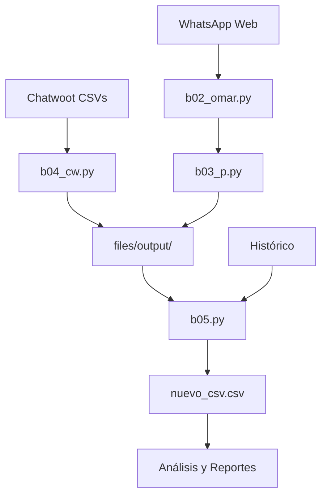

# 🏢 First Time Response Analysis / Analisis de Tiempo de Respuesta

Sistema completo para la extracción, procesamiento y análisis de datos de conversaciones de ventas desde múltiples fuentes (Chatwoot, WhatsApp Web).

## 📋 Resumen del Proyecto

Este proyecto muestra el flujo completo de datos de ventas desde la extracción hasta el análisis final, permitiendo consolidar información de diferentes plataformas y generar reportes por ejecutivo.

## 🗂️ Estructura del Proyecto

```
ventas/
├── 📁 scripts/
│   ├── 📁 cw/           # Scripts de Chatwoot
│   │   ├── b04_cw.py    # Procesador integrado de Chatwoot
│   │   └── README.md    # Documentación de Chatwoot
│   └── 📁 wpp/          # Scripts de WhatsApp Web
│       ├── b01_s.py     # Scraper básico
│       ├── b02_omar.py  # Scraper optimizado
│       ├── b03_p.py     # Procesador de datos
│       └── README.md    # Documentación de WhatsApp
├── 📁 processing/
│   ├── b05.py           # Procesador principal de datos
│   └── README.md        # Documentación de procesamiento
├── 📁 files/
│   ├── 📁 input/        # Datos de entrada
│   │   ├── 📁 cw/       # CSVs de Chatwoot
│   │   ├── 📁 wpp/      # CSVs de WhatsApp
│   ├── 📁 output/       # Datos procesados
│   └── 📁 intermediate/ # Datos intermedios
├── requirements.txt      # Dependencias del proyecto
└── README.md           # Este archivo
```

## 🚀 Funcionalidades Principales

### 📊 Extracción de Datos
- **Chatwoot**: Procesamiento de conversaciones con ajuste horario (-5 horas)
- **WhatsApp Web**: Scraping automatizado de mensajes con perfiles múltiples
- **Consolidación**: Unión de datos históricos con nuevos registros

### 🔧 Procesamiento
- **Normalización de fechas**: Convierte "hoy"/"ayer" y múltiples formatos
- **Normalización de horas**: Procesa diferentes formatos de tiempo
- **Cálculo de métricas**: Tiempo de respuesta, scoring, segmentación horaria
- **Limpieza de datos**: Eliminación de duplicados y normalización

### 📈 Análisis y Reportes
- **Tiempo de respuesta**: Cálculo automático y categorización
- **Segmentación horaria**: Clasificación por franjas del día
- **Reportes por ejecutivo**: Datos separados por agente de ventas
- **Métricas de rendimiento**: Scores de atención al cliente

## 🛠️ Tecnologías Utilizadas

### Core
- **Python 3.8+** - Lenguaje principal
- **Pandas** - Procesamiento de datos
- **NumPy** - Cálculos numéricos

### Web Automation
- **Selenium** - Scraping de WhatsApp Web
- **WebDriver Manager** - Gestión de ChromeDriver

### Data Processing
- **Python-dateutil** - Manejo avanzado de fechas
- **Unicodedata2** - Normalización de texto

## 📦 Instalación

### Prerrequisitos
- Python 3.8 o superior
- Chrome/Chromium (para Selenium)
- Acceso a las plataformas de datos

### Instalación de Dependencias
```bash
# Clonar el repositorio
git clone <repositorio-url>
cd ventas

# Instalar dependencias
pip install -r requirements.txt
```

## 🚀 Guía Rápida

### 1. Procesar Datos de Chatwoot
```bash
cd scripts/cw
python b04_cw.py
```
- Input: `files/input/cw/`
- Output: `files/output/{YYYY-MM-DD}/`

### 2. Extraer Datos de WhatsApp
```bash
cd scripts/wpp

# Extraer mensajes
python b02_omar.py

# Procesar datos
python b03_p.py
```

### 3. Consolidar y Analizar
```bash
cd processing
python b05.py
```
- Input: Histórico + CSVs nuevos
- Output: `files/input/nuevo_csv.csv`

## 📊 Flujo de Trabajo Completo



## 📋 Scripts Disponibles

### Chatwoot (scripts/cw/)
- **b04_cw.py**: Procesador integrado de Chatwoot
  - Ajuste horario (-5 horas)
  - Mapeo de ejecutivos
  - Generación de CSVs por agente

### WhatsApp (scripts/wpp/)
- **b01_s.py**: Scraper básico (200 chats, 40s timeout)
- **b02_omar.py**: Scraper optimizado (5 chats, 20s timeout)
- **b03_p.py**: Procesador de datos de WhatsApp

### Procesamiento Principal (processing/)
- **b05.py**: Consolidador y analizador principal
  - Unión de datos históricos
  - Normalización de fechas/horas
  - Cálculo de métricas
  - Scoring y segmentación

## ⚙️ Configuración

### Variables de Entorno
```python
# Chatwoot
CARPETA_ENTRADA_CW = "files/input/cw"
CARPETA_SALIDA_CW = "files/output"

# WhatsApp
PERFILES_WPP = ["wpp1", "wpp2", "wpp3", "wpp4", "wpp5", "wpp6"]
CARPETA_WPP = "files/input/wpp"

# Procesamiento
HISTORICO = "files/input/nuevo_csv.csv"
CARPETAS_NUEVAS = "files/output/12_18_ene"
```

### Mapeo de Ejecutivos
```python
EJECUTIVOS_CW = {
    7: "Eduardo",
    3: "Karina", 
    4: "Jennifer"
}

EJECUTIVOS_WPP = {
    "Karina Evedove Asesora de viajes a Peru ILLAPA CULTURAS ANDINAS",
    "Ros Papel - Agente de viajes",
    "Eduardo/Asesor de Viajes a Perú",
    "Jennifer Formiga - Asesora de Viajes a Perú",
    "Estrella Condori"
}
```

## 📈 Métricas y Scoring

### Tiempo de Respuesta
- ⚙️ **Automático**: < 1 minuto
- 🟢 **Excelente**: ≤ 5 minutos
- 🟡 **Bueno**: ≤ 15 minutos
- 🟠 **Regular**: ≤ 60 minutos
- 🔴 **Lento**: ≤ 24 horas
- ⚫ **Muy Lento**: > 24 horas
- ⚠️ **Outbound**: Mensaje saliente primero
- ❌ **No respondido**: Sin respuesta

### Segmentación Horaria
- 🌙 **Madrugada**: 00:00 - 05:59
- 🌤 **Mañana no laborable**: 06:00 - 08:59
- ☀️ **Mañana laborable**: 09:00 - 12:59
- 🌇 **Tarde**: 13:00 - 17:59
- 🌆 **Noche**: 18:00 - 22:59
- 🌒 **Noche tarde**: 23:00 - 23:59

## 🐛 Solución de Problemas

### Issues Comunes

**1. ChromeDriver no encontrado**
```bash
# Limpiar caché de WebDriver
rm -rf ~/.wdm/drivers/
```

**2. Permisos de WhatsApp Web**
- Escanear código QR al inicio
- Esperar carga completa antes de continuar

**3. Fechas no reconocidas**
- El script maneja "hoy"/"ayer" automáticamente
- Soporta múltiples formatos de fecha

**4. Duplicados en datos**
- Eliminación automática por ID_LEAD
- Conserva primer registro encontrado

## 📞 Soporte

### Documentación Específica
- [Chatwoot Processing](scripts/cw/README.md)
- [WhatsApp Processing](scripts/wpp/README.md)
- [Data Processing](processing/README.md)

### Requisitos del Sistema
- Verificar [requirements.txt](requirements.txt) para dependencias
- Chrome/Chromium para Selenium
- Python 3.8+ con pip

### Contacto y Ayuda
1. Revisar documentación específica de cada módulo
2. Verificar logs de ejecución
3. Validar configuración de rutas
4. Consultar troubleshooting en READMEs individuales

## 📄 Licencia

Este proyecto es para uso interno de procesamiento de datos de ventas.

---

**Última actualización**: Enero 2026
**Versión**: 1.0.0
